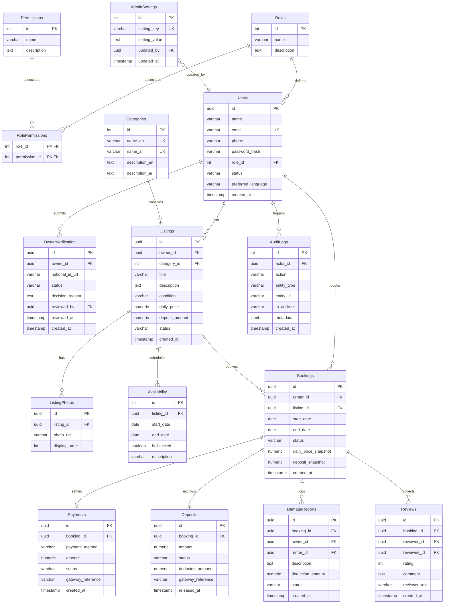

# Database Design Specification — Item Rental System

This document provides the complete database design for the Item Rental System. It outlines table structures, data types, indexes, relational constraints, a Mermaid Entity-Relationship Diagram (ERD), a normalization analysis, and a complete PostgreSQL DDL schema script.

The design supports every use case defined in [use_cases.md](file:///E:/UserFiles/Desktop/hackthon/use_cases.md) and complies with the rules in [software_requirements_specification.md](file:///E:/UserFiles/Desktop/hackthon/software_requirements_specification.md).

---

## 1. Mermaid Entity-Relationship Diagram (ERD)



---

## 2. Table-by-Table Data Dictionary

### 2.1 Roles
Stores role categories defining user levels.
*   **Columns**:
    *   `id`: `INT` | **PK** | Auto-increment.
    *   `name`: `VARCHAR(50)` | **UNIQUE** | e.g., 'GUEST', 'RENTER', 'OWNER', 'ADMIN'.
    *   `description`: `TEXT` | Nullable.
    *   `created_at`: `TIMESTAMP` | Default `NOW()`.

### 2.2 Permissions
Stores the operations that can be governed by RBAC.
*   **Columns**:
    *   `id`: `INT` | **PK** | Auto-increment.
    *   `name`: `VARCHAR(100)` | **UNIQUE** | e.g., 'CREATE_LISTING', 'BOOK_ITEM'.
    *   `description`: `TEXT` | Nullable.

### 2.3 RolePermissions
Join table linking Roles and Permissions.
*   **Columns**:
    *   `role_id`: `INT` | **PK**, **FK** references `Roles(id)` ON DELETE CASCADE.
    *   `permission_id`: `INT` | **PK**, **FK** references `Permissions(id)` ON DELETE CASCADE.

### 2.4 Users
Represents both renters, owners, and administrators.
*   **Columns**:
    *   `id`: `UUID` | **PK** | Default `uuid_generate_v4()`.
    *   `name`: `VARCHAR(100)` | NOT NULL.
    *   `email`: `VARCHAR(255)` | NOT NULL | **UNIQUE** | Check format.
    *   `phone`: `VARCHAR(20)` | NOT NULL.
    *   `password_hash`: `VARCHAR(255)` | NOT NULL.
    *   `role_id`: `INT` | **FK** references `Roles(id)`.
    *   `status`: `VARCHAR(20)` | NOT NULL | Default 'Active' | **Constraint**: `CHECK (status IN ('Active', 'Suspended'))`.
    *   `preferred_language`: `VARCHAR(5)` | NOT NULL | Default 'en' | **Constraint**: `CHECK (preferred_language IN ('en', 'ar'))`.
    *   `created_at`: `TIMESTAMP` | Default `NOW()`.
    *   `updated_at`: `TIMESTAMP` | Default `NOW()`.
*   **Indexes**: Unique index on `email`.

### 2.5 OwnerVerification
Holds ID verification submissions and moderation decisions.
*   **Columns**:
    *   `id`: `UUID` | **PK** | Default `uuid_generate_v4()`.
    *   `owner_id`: `UUID` | NOT NULL | **FK** references `Users(id)` ON DELETE CASCADE.
    *   `national_id_url`: `VARCHAR(2048)` | NOT NULL.
    *   `status`: `VARCHAR(20)` | NOT NULL | Default 'Pending' | **Constraint**: `CHECK (status IN ('Pending', 'Approved', 'Rejected'))`.
    *   `decision_reason`: `TEXT` | Nullable.
    *   `reviewed_by`: `UUID` | **FK** references `Users(id)` | Nullable.
    *   `reviewed_at`: `TIMESTAMP` | Nullable.
    *   `created_at`: `TIMESTAMP` | Default `NOW()`.
    *   `updated_at`: `TIMESTAMP` | Default `NOW()`.
*   **Indexes**: Index on `owner_id`, index on `status`.

### 2.6 Categories
Admin-managed hierarchical classification taxonomy.
*   **Columns**:
    *   `id`: `INT` | **PK** | Auto-increment.
    *   `name_en`: `VARCHAR(100)` | NOT NULL | **UNIQUE**.
    *   `name_ar`: `VARCHAR(100)` | NOT NULL | **UNIQUE**.
    *   `description_en`: `TEXT` | Nullable.
    *   `description_ar`: `TEXT` | Nullable.
    *   `created_at`: `TIMESTAMP` | Default `NOW()`.

### 2.7 Listings
Items published for rent.
*   **Columns**:
    *   `id`: `UUID` | **PK** | Default `uuid_generate_v4()`.
    *   `owner_id`: `UUID` | NOT NULL | **FK** references `Users(id)`.
    *   `category_id`: `INT` | NOT NULL | **FK** references `Categories(id)`.
    *   `title`: `VARCHAR(100)` | NOT NULL | **Constraint**: `CHECK (length(title) >= 5)`.
    *   `description`: `TEXT` | NOT NULL | **Constraint**: `CHECK (length(description) >= 20)`.
    *   `condition`: `VARCHAR(20)` | NOT NULL | **Constraint**: `CHECK (condition IN ('New', 'Good', 'Acceptable'))`.
    *   `daily_price`: `NUMERIC(10, 2)` | NOT NULL | **Constraint**: `CHECK (daily_price >= 0.00)`.
    *   `deposit_amount`: `NUMERIC(10, 2)` | NOT NULL | **Constraint**: `CHECK (deposit_amount >= 0.00)`.
    *   `status`: `VARCHAR(30)` | NOT NULL | Default 'Pending Approval' | **Constraint**: `CHECK (status IN ('Pending Approval', 'Active', 'Rejected'))`.
    *   `created_at`: `TIMESTAMP` | Default `NOW()`.
    *   `updated_at`: `TIMESTAMP` | Default `NOW()`.
*   **Indexes**: Indexes on `owner_id`, `category_id`, `status`. Full-text search index on `title` and `description`.

### 2.8 ListingPhotos
Asset references for listing photos hosted on Cloudinary.
*   **Columns**:
    *   `id`: `UUID` | **PK** | Default `uuid_generate_v4()`.
    *   `listing_id`: `UUID` | NOT NULL | **FK** references `Listings(id)` ON DELETE CASCADE.
    *   `photo_url`: `VARCHAR(2048)` | NOT NULL.
    *   `display_order`: `INT` | NOT NULL | Default 0.
    *   `created_at`: `TIMESTAMP` | Default `NOW()`.
*   **Indexes**: Index on `listing_id`.

### 2.9 Availability
Calendaring model for owner blockouts.
*   **Columns**:
    *   `id`: `INT` | **PK** | Auto-increment.
    *   `listing_id`: `UUID` | NOT NULL | **FK** references `Listings(id)` ON DELETE CASCADE.
    *   `start_date`: `DATE` | NOT NULL.
    *   `end_date`: `DATE` | NOT NULL | **Constraint**: `CHECK (end_date >= start_date)`.
    *   `is_blocked`: `BOOLEAN` | NOT NULL | Default TRUE.
    *   `description`: `VARCHAR(255)` | Nullable.
*   **Indexes**: Index on `listing_id`, index on `(start_date, end_date)`.

### 2.10 Bookings
Rental agreements and date locks.
*   **Columns**:
    *   `id`: `UUID` | **PK** | Default `uuid_generate_v4()`.
    *   `renter_id`: `UUID` | NOT NULL | **FK** references `Users(id)`.
    *   `listing_id`: `UUID` | NOT NULL | **FK** references `Listings(id)`.
    *   `start_date`: `DATE` | NOT NULL.
    *   `end_date`: `DATE` | NOT NULL | **Constraint**: `CHECK (end_date >= start_date)`.
    *   `status`: `VARCHAR(20)` | NOT NULL | Default 'Pending' | **Constraint**: `CHECK (status IN ('Pending', 'Approved', 'Active', 'Returned', 'Cancelled', 'Rejected'))`.
    *   `daily_price_snapshot`: `NUMERIC(10, 2)` | NOT NULL.
    *   `deposit_snapshot`: `NUMERIC(10, 2)` | NOT NULL.
    *   `created_at`: `TIMESTAMP` | Default `NOW()`.
    *   `updated_at`: `TIMESTAMP` | Default `NOW()`.
*   **Indexes**: Index on `renter_id`, `listing_id`, `status`.

### 2.11 Payments
Rental checkout records.
*   **Columns**:
    *   `id`: `UUID` | **PK** | Default `uuid_generate_v4()`.
    *   `booking_id`: `UUID` | NOT NULL | **FK** references `Bookings(id)` ON DELETE RESTRICT.
    *   `payment_method`: `VARCHAR(30)` | NOT NULL | **Constraint**: `CHECK (payment_method IN ('Online Payment', 'Cash On Pickup'))`.
    *   `amount`: `NUMERIC(10, 2)` | NOT NULL | **Constraint**: `CHECK (amount >= 0.00)`.
    *   `status`: `VARCHAR(30)` | NOT NULL | **Constraint**: `CHECK (status IN ('Pending Cash Exchange', 'Paid', 'Failed', 'Collected'))`.
    *   `gateway_reference`: `VARCHAR(255)` | Nullable.
    *   `created_at`: `TIMESTAMP` | Default `NOW()`.
    *   `updated_at`: `TIMESTAMP` | Default `NOW()`.
*   **Indexes**: Index on `booking_id`, `status`.

### 2.12 Deposits
Dedicated security deposit ledger records.
*   **Columns**:
    *   `id`: `UUID` | **PK** | Default `uuid_generate_v4()`.
    *   `booking_id`: `UUID` | NOT NULL | **FK** references `Bookings(id)` ON DELETE RESTRICT | **UNIQUE**.
    *   `amount`: `NUMERIC(10, 2)` | NOT NULL | **Constraint**: `CHECK (amount >= 0.00)`.
    *   `status`: `VARCHAR(20)` | NOT NULL | **Constraint**: `CHECK (status IN ('Authorized', 'Held', 'Released', 'Deducted', 'Refunded'))`.
    *   `deducted_amount`: `NUMERIC(10, 2)` | NOT NULL | Default 0.00 | **Constraint**: `CHECK (deducted_amount >= 0.00)`.
    *   `gateway_reference`: `VARCHAR(255)` | Nullable.
    *   `released_at`: `TIMESTAMP` | Nullable.
    *   `created_at`: `TIMESTAMP` | Default `NOW()`.
    *   `updated_at`: `TIMESTAMP` | Default `NOW()`.

### 2.13 DamageReports
Logged damage disputes submitted by owners.
*   **Columns**:
    *   `id`: `UUID` | **PK** | Default `uuid_generate_v4()`.
    *   `booking_id`: `UUID` | NOT NULL | **FK** references `Bookings(id)` ON DELETE RESTRICT.
    *   `owner_id`: `UUID` | NOT NULL | **FK** references `Users(id)`.
    *   `renter_id`: `UUID` | NOT NULL | **FK** references `Users(id)`.
    *   `description`: `TEXT` | NOT NULL | **Constraint**: `CHECK (length(description) >= 10)`.
    *   `deduction_amount`: `NUMERIC(10, 2)` | NOT NULL | **Constraint**: `CHECK (deduction_amount > 0.00)`.
    *   `status`: `VARCHAR(20)` | NOT NULL | Default 'Submitted' | **Constraint**: `CHECK (status IN ('Submitted', 'Under Review', 'Approved', 'Dismissed'))`.
    *   `created_at`: `TIMESTAMP` | Default `NOW()`.
    *   `updated_at`: `TIMESTAMP` | Default `NOW()`.
*   **Indexes**: Indexes on `booking_id`, `owner_id`, `renter_id`.

### 2.14 Reviews
Reputation feedback ratings.
*   **Columns**:
    *   `id`: `UUID` | **PK** | Default `uuid_generate_v4()`.
    *   `booking_id`: `UUID` | NOT NULL | **FK** references `Bookings(id)` ON DELETE CASCADE.
    *   `reviewer_id`: `UUID` | NOT NULL | **FK** references `Users(id)`.
    *   `reviewee_id`: `UUID` | NOT NULL | **FK** references `Users(id)`.
    *   `rating`: `INT` | NOT NULL | **Constraint**: `CHECK (rating >= 1 AND rating <= 5)`.
    *   `comment`: `TEXT` | Nullable | **Constraint**: `CHECK (length(comment) <= 500)`.
    *   `reviewer_role`: `VARCHAR(20)` | NOT NULL | **Constraint**: `CHECK (reviewer_role IN ('Renter', 'Owner'))`.
    *   `created_at`: `TIMESTAMP` | Default `NOW()`.
*   **Indexes**: Unique index on `(booking_id, reviewer_role)` to enforce the single-review rule.

### 2.15 AdminSettings
Global parameters configured by Admins.
*   **Columns**:
    *   `id`: `INT` | **PK** | Auto-increment.
    *   `setting_key`: `VARCHAR(100)` | NOT NULL | **UNIQUE**.
    *   `setting_value`: `TEXT` | NOT NULL.
    *   `description`: `TEXT` | Nullable.
    *   `updated_by`: `UUID` | **FK** references `Users(id)`.
    *   `updated_at`: `TIMESTAMP` | Default `NOW()`.

### 2.16 AuditLogs
Immutable log tracking administrative and transactional events.
*   **Columns**:
    *   `id`: `INT` | **PK** | Auto-increment.
    *   `actor_id`: `UUID` | **FK** references `Users(id)` ON DELETE SET NULL | Nullable.
    *   `action`: `VARCHAR(100)` | NOT NULL.
    *   `entity_type`: `VARCHAR(50)` | NOT NULL.
    *   `entity_id`: `VARCHAR(100)` | NOT NULL.
    *   `ip_address`: `VARCHAR(45)` | Nullable.
    *   `metadata`: `JSONB` | Nullable.
    *   `created_at`: `TIMESTAMP` | Default `NOW()`.

---

## 3. Normalization Analysis

### First Normal Form (1NF)
*   **Rule**: Atomic values, no repeating groups, unique keys.
*   **Compliance**: Handled. Multi-valued fields (e.g. photos) are placed in a child table `ListingPhotos`. Every table contains a Primary Key (`id` or composited key).

### Second Normal Form (2NF)
*   **Rule**: Must be in 1NF, and all non-key attributes must be fully functionally dependent on the primary key.
*   **Compliance**: Handled. In the join table `RolePermissions`, the only columns are the composite PK keys `role_id` and `permission_id`. For single-key tables, partial dependencies are mathematically impossible.

### Third Normal Form (3NF)
*   **Rule**: Must be in 2NF, and no transitive dependencies must exist (non-key columns depend only on primary key).
*   **Compliance**: Handled. Values like renter name are not stored inside `Bookings` (which would trigger a transitive relationship: `booking_id` -> `renter_id` -> `renter_name`). Only the `renter_id` foreign key is referenced.
*   *Note on Snapshots*: Columns `daily_price_snapshot` and `deposit_snapshot` in `Bookings` represent a historic snapshot taken at transaction time. This does not violate 3NF because it represents a distinct historical fact (the price agreed during booking) that does not change even if the parent listing's price changes.

---

## 4. PostgreSQL DDL SQL Schema Script

This SQL script activates the necessary database extensions, creates tables, and enforces data constraints.

```sql
-- Enable UUID and Exclusion Extension
CREATE EXTENSION IF NOT EXISTS "uuid-ossp";
CREATE EXTENSION IF NOT EXISTS "btree_gist";

-- ==========================================
-- 1. Roles & Permissions
-- ==========================================
CREATE TABLE roles (
    id SERIAL PRIMARY KEY,
    name VARCHAR(50) NOT NULL UNIQUE,
    description TEXT,
    created_at TIMESTAMP NOT NULL DEFAULT NOW()
);

CREATE TABLE permissions (
    id SERIAL PRIMARY KEY,
    name VARCHAR(100) NOT NULL UNIQUE,
    description TEXT
);

CREATE TABLE role_permissions (
    role_id INT NOT NULL REFERENCES roles(id) ON DELETE CASCADE,
    permission_id INT NOT NULL REFERENCES permissions(id) ON DELETE CASCADE,
    PRIMARY KEY (role_id, permission_id)
);

-- ==========================================
-- 2. Users & Verifications
-- ==========================================
CREATE TABLE users (
    id UUID PRIMARY KEY DEFAULT uuid_generate_v4(),
    name VARCHAR(100) NOT NULL,
    email VARCHAR(255) NOT NULL UNIQUE,
    phone VARCHAR(20) NOT NULL,
    password_hash VARCHAR(255) NOT NULL,
    role_id INT NOT NULL REFERENCES roles(id),
    status VARCHAR(20) NOT NULL DEFAULT 'Active',
    preferred_language VARCHAR(5) NOT NULL DEFAULT 'en',
    created_at TIMESTAMP NOT NULL DEFAULT NOW(),
    updated_at TIMESTAMP NOT NULL DEFAULT NOW(),
    CONSTRAINT chk_user_email CHECK (email ~* '^[A-Za-z0-9._%-]+@[A-Za-z0-9.-]+\.[A-Za-z]{2,4}$'),
    CONSTRAINT chk_user_status CHECK (status IN ('Active', 'Suspended')),
    CONSTRAINT chk_user_lang CHECK (preferred_language IN ('en', 'ar'))
);

CREATE TABLE owner_verifications (
    id UUID PRIMARY KEY DEFAULT uuid_generate_v4(),
    owner_id UUID NOT NULL REFERENCES users(id) ON DELETE CASCADE,
    national_id_url VARCHAR(2048) NOT NULL,
    status VARCHAR(20) NOT NULL DEFAULT 'Pending',
    decision_reason TEXT,
    reviewed_by UUID REFERENCES users(id) ON DELETE SET NULL,
    reviewed_at TIMESTAMP,
    created_at TIMESTAMP NOT NULL DEFAULT NOW(),
    updated_at TIMESTAMP NOT NULL DEFAULT NOW(),
    CONSTRAINT chk_verification_status CHECK (status IN ('Pending', 'Approved', 'Rejected'))
);

-- ==========================================
-- 3. Categories & Listings
-- ==========================================
CREATE TABLE categories (
    id SERIAL PRIMARY KEY,
    name_en VARCHAR(100) NOT NULL UNIQUE,
    name_ar VARCHAR(100) NOT NULL UNIQUE,
    description_en TEXT,
    description_ar TEXT,
    created_at TIMESTAMP NOT NULL DEFAULT NOW()
);

CREATE TABLE listings (
    id UUID PRIMARY KEY DEFAULT uuid_generate_v4(),
    owner_id UUID NOT NULL REFERENCES users(id) ON DELETE RESTRICT,
    category_id INT NOT NULL REFERENCES categories(id) ON DELETE RESTRICT,
    title VARCHAR(100) NOT NULL,
    description TEXT NOT NULL,
    condition VARCHAR(20) NOT NULL,
    daily_price NUMERIC(10, 2) NOT NULL,
    deposit_amount NUMERIC(10, 2) NOT NULL,
    status VARCHAR(30) NOT NULL DEFAULT 'Pending Approval',
    created_at TIMESTAMP NOT NULL DEFAULT NOW(),
    updated_at TIMESTAMP NOT NULL DEFAULT NOW(),
    CONSTRAINT chk_listing_title CHECK (char_length(title) >= 5),
    CONSTRAINT chk_listing_desc CHECK (char_length(description) >= 20),
    CONSTRAINT chk_listing_condition CHECK (condition IN ('New', 'Good', 'Acceptable')),
    CONSTRAINT chk_listing_price CHECK (daily_price >= 0.00),
    CONSTRAINT chk_listing_deposit CHECK (deposit_amount >= 0.00),
    CONSTRAINT chk_listing_status CHECK (status IN ('Pending Approval', 'Active', 'Rejected'))
);

CREATE TABLE listing_photos (
    id UUID PRIMARY KEY DEFAULT uuid_generate_v4(),
    listing_id UUID NOT NULL REFERENCES listings(id) ON DELETE CASCADE,
    photo_url VARCHAR(2048) NOT NULL,
    display_order INT NOT NULL DEFAULT 0,
    created_at TIMESTAMP NOT NULL DEFAULT NOW()
);

-- ==========================================
-- 4. Calendar Availability (Owner Blockouts)
-- ==========================================
CREATE TABLE availability (
    id SERIAL PRIMARY KEY,
    listing_id UUID NOT NULL REFERENCES listings(id) ON DELETE CASCADE,
    start_date DATE NOT NULL,
    end_date DATE NOT NULL,
    is_blocked BOOLEAN NOT NULL DEFAULT TRUE,
    description VARCHAR(255),
    CONSTRAINT chk_availability_dates CHECK (end_date >= start_date)
);

-- ==========================================
-- 5. Bookings & Exclusion Constraints
-- ==========================================
CREATE TABLE bookings (
    id UUID PRIMARY KEY DEFAULT uuid_generate_v4(),
    renter_id UUID NOT NULL REFERENCES users(id) ON DELETE RESTRICT,
    listing_id UUID NOT NULL REFERENCES listings(id) ON DELETE RESTRICT,
    start_date DATE NOT NULL,
    end_date DATE NOT NULL,
    status VARCHAR(20) NOT NULL DEFAULT 'Pending',
    daily_price_snapshot NUMERIC(10, 2) NOT NULL,
    deposit_snapshot NUMERIC(10, 2) NOT NULL,
    created_at TIMESTAMP NOT NULL DEFAULT NOW(),
    updated_at TIMESTAMP NOT NULL DEFAULT NOW(),
    CONSTRAINT chk_booking_dates CHECK (end_date >= start_date),
    CONSTRAINT chk_booking_status CHECK (status IN ('Pending', 'Approved', 'Active', 'Returned', 'Cancelled', 'Rejected')),
    -- PostgreSQL EXCLUDE constraint preventing overlapping approved bookings on the same item
    CONSTRAINT exclude_booking_overlaps EXCLUDE USING gist (
        listing_id WITH =,
        daterange(start_date, end_date, '[]') WITH &&
    ) WHERE (status = 'Approved' OR status = 'Active')
);

-- ==========================================
-- 6. Payments & Deposit Ledgers
-- ==========================================
CREATE TABLE payments (
    id UUID PRIMARY KEY DEFAULT uuid_generate_v4(),
    booking_id UUID NOT NULL REFERENCES bookings(id) ON DELETE RESTRICT,
    payment_method VARCHAR(30) NOT NULL,
    amount NUMERIC(10, 2) NOT NULL,
    status VARCHAR(30) NOT NULL,
    gateway_reference VARCHAR(255),
    created_at TIMESTAMP NOT NULL DEFAULT NOW(),
    updated_at TIMESTAMP NOT NULL DEFAULT NOW(),
    CONSTRAINT chk_payment_method CHECK (payment_method IN ('Online Payment', 'Cash On Pickup')),
    CONSTRAINT chk_payment_amount CHECK (amount >= 0.00),
    CONSTRAINT chk_payment_status CHECK (status IN ('Pending Cash Exchange', 'Paid', 'Failed', 'Collected'))
);

CREATE TABLE deposits (
    id UUID PRIMARY KEY DEFAULT uuid_generate_v4(),
    booking_id UUID NOT NULL REFERENCES bookings(id) ON DELETE RESTRICT UNIQUE,
    amount NUMERIC(10, 2) NOT NULL,
    status VARCHAR(20) NOT NULL,
    deducted_amount NUMERIC(10, 2) NOT NULL DEFAULT 0.00,
    gateway_reference VARCHAR(255),
    released_at TIMESTAMP,
    created_at TIMESTAMP NOT NULL DEFAULT NOW(),
    updated_at TIMESTAMP NOT NULL DEFAULT NOW(),
    CONSTRAINT chk_deposit_amount CHECK (amount >= 0.00),
    CONSTRAINT chk_deposit_deduction CHECK (deducted_amount >= 0.00 AND deducted_amount <= amount),
    CONSTRAINT chk_deposit_status CHECK (status IN ('Authorized', 'Held', 'Released', 'Deducted', 'Refunded'))
);

-- ==========================================
-- 7. Damage Reports & Reviews
-- ==========================================
CREATE TABLE damage_reports (
    id UUID PRIMARY KEY DEFAULT uuid_generate_v4(),
    booking_id UUID NOT NULL REFERENCES bookings(id) ON DELETE RESTRICT,
    owner_id UUID NOT NULL REFERENCES users(id) ON DELETE RESTRICT,
    renter_id UUID NOT NULL REFERENCES users(id) ON DELETE RESTRICT,
    description TEXT NOT NULL,
    deduction_amount NUMERIC(10, 2) NOT NULL,
    status VARCHAR(20) NOT NULL DEFAULT 'Submitted',
    created_at TIMESTAMP NOT NULL DEFAULT NOW(),
    updated_at TIMESTAMP NOT NULL DEFAULT NOW(),
    CONSTRAINT chk_damage_desc CHECK (char_length(description) >= 10),
    CONSTRAINT chk_damage_deduction CHECK (deduction_amount > 0.00),
    CONSTRAINT chk_damage_status CHECK (status IN ('Submitted', 'Under Review', 'Approved', 'Dismissed'))
);

CREATE TABLE reviews (
    id UUID PRIMARY KEY DEFAULT uuid_generate_v4(),
    booking_id UUID NOT NULL REFERENCES bookings(id) ON DELETE CASCADE,
    reviewer_id UUID NOT NULL REFERENCES users(id) ON DELETE RESTRICT,
    reviewee_id UUID NOT NULL REFERENCES users(id) ON DELETE RESTRICT,
    rating INT NOT NULL,
    comment TEXT,
    reviewer_role VARCHAR(20) NOT NULL,
    created_at TIMESTAMP NOT NULL DEFAULT NOW(),
    CONSTRAINT chk_review_rating CHECK (rating >= 1 AND rating <= 5),
    CONSTRAINT chk_review_comment CHECK (char_length(comment) <= 500),
    CONSTRAINT chk_review_role CHECK (reviewer_role IN ('Renter', 'Owner')),
    -- Enforce only 1 review per role per booking
    CONSTRAINT uq_booking_reviewer_role UNIQUE (booking_id, reviewer_role)
);

-- ==========================================
-- 8. Admin Settings & Audit Trails
-- ==========================================
CREATE TABLE admin_settings (
    id SERIAL PRIMARY KEY,
    setting_key VARCHAR(100) NOT NULL UNIQUE,
    setting_value TEXT NOT NULL,
    description TEXT,
    updated_by UUID REFERENCES users(id) ON DELETE SET NULL,
    updated_at TIMESTAMP NOT NULL DEFAULT NOW()
);

CREATE TABLE audit_logs (
    id SERIAL PRIMARY KEY,
    actor_id UUID REFERENCES users(id) ON DELETE SET NULL,
    action VARCHAR(100) NOT NULL,
    entity_type VARCHAR(50) NOT NULL,
    entity_id VARCHAR(100) NOT NULL,
    ip_address VARCHAR(45),
    metadata JSONB,
    created_at TIMESTAMP NOT NULL DEFAULT NOW()
);

-- Prevent Updates or Deletions on Audit Logs to enforce immutability
CREATE RULE no_update_audit AS ON UPDATE TO audit_logs DO INSTEAD NOTHING;
CREATE RULE no_delete_audit AS ON DELETE TO audit_logs DO INSTEAD NOTHING;

-- ==========================================
-- 9. Indices for Performance Optimization
-- ==========================================
CREATE INDEX idx_users_role ON users(role_id);
CREATE INDEX idx_verifications_owner ON owner_verifications(owner_id);
CREATE INDEX idx_verifications_status ON owner_verifications(status);
CREATE INDEX idx_listings_owner ON listings(owner_id);
CREATE INDEX idx_listings_category ON listings(category_id);
CREATE INDEX idx_listings_status ON listings(status);
CREATE INDEX idx_photos_listing ON listing_photos(listing_id);
CREATE INDEX idx_availability_dates ON availability(start_date, end_date);
CREATE INDEX idx_bookings_renter ON bookings(renter_id);
CREATE INDEX idx_bookings_listing ON bookings(listing_id);
CREATE INDEX idx_bookings_status ON bookings(status);
CREATE INDEX idx_bookings_dates ON bookings(start_date, end_date);
CREATE INDEX idx_payments_booking ON payments(booking_id);
CREATE INDEX idx_damage_booking ON damage_reports(booking_id);
CREATE INDEX idx_reviews_booking ON reviews(booking_id);
CREATE INDEX idx_audit_created ON audit_logs(created_at);

-- Full-Text Search Indices for Listings
CREATE INDEX idx_listings_search_en ON listings USING gin(to_tsvector('english', title || ' ' || description));
```
