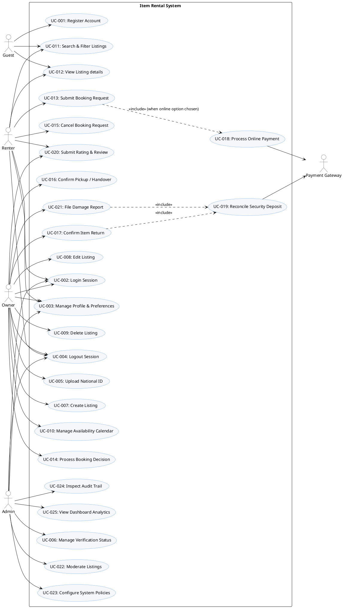

# Use Case Specification — Item Rental System

This document specifies the Use Case model for the Item Rental System, defining system boundaries, actors, relationships, and detailed use case descriptions. Every use case is linked to the User Stories defined in [user_stories.md](file:///E:/UserFiles/Desktop/hackthon/user_stories.md) and traces back to the [software_requirements_specification.md](file:///E:/UserFiles/Desktop/hackthon/software_requirements_specification.md).

---

## 1. System Boundary and Actors

The **Item Rental System** boundary includes all internal services (Authentication, Listings, Bookings, Deposits, Admin Governance) managed by the platform. The boundaries interface with external systems (such as the Payment Gateway).

### Actor Definitions
*   **Guest**: An anonymous, unauthenticated user browsing the public marketplace.
*   **Renter**: A registered and logged-in user who browses, searches, and requests to rent items.
*   **Owner**: A registered and logged-in user who creates listings, schedules availability, reviews booking requests, and reports item damage.
*   **Admin**: A privileged operator responsible for moderation, category setup, financial analytics, policy adjustments, and auditing.
*   **Payment Gateway** *(External System Actor)*: An external service (e.g., Stripe) that processes credit/debit card authorizations, captures, and refunds.

---

## 2. PlantUML Use Case Diagram Code

You can render the following code in any PlantUML editor to generate the visual use case diagram:

---

## 3. Relationships Summary
*   **Association**: Direct links connect actors to their respective use cases (e.g., `Guest` initiates `Register Account`, `Owner` initiates `Create Listing`).
*   **Include (`<<include>>`)**:
    *   `UC-013 (Submit Booking Request)` includes `UC-018 (Process Online Payment)` when the renter opts for online checkout.
    *   `UC-017 (Confirm Item Return)` includes `UC-019 (Reconcile Security Deposit)` to initiate automatic deposit release.
    *   `UC-021 (File Damage Report)` includes `UC-019 (Reconcile Security Deposit)` to deduct repair costs before refunding any remainder.
*   **Actor Generalization**: A registered user (Owner, Renter, Admin) generalizes the capabilities of a Guest for searching and viewing listings, though they operate using authenticated tokens.

---

## 4. Use Case Descriptions & Traceability Matrix

| Use Case ID & Title | Mapped User Stories | Primary Actor | Description | Pre-conditions | Post-conditions |
| :--- | :--- | :--- | :--- | :--- | :--- |
| **UC-001: Register Account** | US-001 | Guest | Registers a new account with email, phone, name, password, and language preference. | Guest is on the registration page. | Account is created in pending verification state; language preference is saved. |
| **UC-002: Login Session** | US-002 | Renter / Owner / Admin | Authenticates email and password to generate a secure JWT. | Account exists in the system. | User receives JWT session token. |
| **UC-003: Manage Profile & Preferences** | US-003 | Renter / Owner / Admin | Updates personal details and switches UI language/direction. | User is authenticated. | Profile record is updated; UI switches RTL/LTR layout instantly if language toggled. |
| **UC-004: Logout Session** | US-004 | Renter / Owner / Admin | Terminates user session and clears local JWT storage. | User is authenticated. | JWT token is invalidated client-side. |
| **UC-005: Upload National ID** | US-005 | Owner | Uploads a National ID scan for account verification. | Owner is authenticated and unverified. | ID uploaded to Cloudinary; verification request status set to `Pending`. |
| **UC-006: Manage Verification Status** | US-006, US-024 | Admin | Reviews ID scans and approves or rejects owner verification. | Verification request status is `Pending`. | Owner verification status updated to `Approved` or `Rejected`. |
| **UC-007: Create Listing** | US-007 | Owner | Creates a rental listing specifying title, price, category, photos, and deposit. | Owner verification status is `Approved`. | Listing created in `Pending Approval` status. |
| **UC-008: Edit Listing** | US-008 | Owner | Updates title, condition, price, or description of an existing listing. | Owner owns the listing and is authenticated. | Listing is updated; status returns to `Pending Approval` for re-moderation. |
| **UC-009: Delete Listing** | US-009 | Owner | Soft-deletes a listing to hide it from search. | Owner owns the listing and is authenticated. | Listing is hidden from search; historical bookings preserved. |
| **UC-010: Manage Availability Calendar** | US-010 | Owner | Sets personal blockout dates on the listing calendar. | Listing exists and owner is authenticated. | Selected date ranges are marked unavailable in search queries. |
| **UC-011: Search & Filter Listings** | US-011 | Guest / Renter | Queries listings matching keywords and filters. | Guest or Renter is on search page. | Displays available listings matching search filters. |
| **UC-012: View Listing details** | US-012, US-013 | Guest / Renter | Opens listing detail page to view photos, prices, ratings, and verification status. | Listing exists and is active. | Detailed attributes and owner trust summaries rendered. |
| **UC-013: Submit Booking Request** | US-014 | Renter | Reserves a listing for a future date range. | Renter is authenticated; dates are available. | Booking created in `Pending` status; dates reserved. Includes payment authorization. |
| **UC-014: Process Booking Decision** | US-015 | Owner | Approves or rejects a renter's pending booking request. | Booking status is `Pending`. | Booking status updated to `Approved` (dates blocked) or `Rejected`. |
| **UC-015: Cancel Booking Request** | US-016 | Renter | Cancels a booking request before it is approved. | Booking status is `Pending`. | Booking status updated to `Cancelled`; dates released. |
| **UC-016: Confirm Pickup / Handover** | US-017, US-019 | Owner | Confirms item has been handed over, updating booking and payment states. | Booking status is `Approved`. | Booking status becomes `Active`; cash collection recorded if applicable. |
| **UC-017: Confirm Item Return** | US-017 | Owner | Confirms item return, starting deposit release. | Booking status is `Active`. | Booking status becomes `Returned`; deposit release process triggered. |
| **UC-018: Process Online Payment** | US-018 | Renter | Integrates with gateway to capture rental fee and authorize deposit. | Booking request is validated. | Payment status set to `Paid` (fee) / `Authorized` (deposit) (External Gateway). |
| **UC-019: Reconcile Security Deposit** | US-020, US-021 | Renter / Owner | Releases deposit to renter or deducts damage fees. | Booking status is `Returned`. | Deposit is released or adjusted; ledger records updated (External Gateway). |
| **UC-020: Submit Rating & Review** | US-022 | Renter / Owner | Rates the transaction experience out of 5 stars. | Booking status is `Returned`. | Review saved; aggregated rating updated on recipient's profile. |
| **UC-021: File Damage Report** | US-023 | Owner | Reports item damage, uploads evidence, and requests deduction. | Booking status is `Active` or returned < 48 hours ago. | Report saved in `Submitted` status; automatic deposit release suspended. |
| **UC-022: Moderate Listings** | US-025 | Admin | Approves or rejects listings from the moderation queue. | Listing status is `Pending Approval`. | Listing status updated to `Active` (visible to search) or `Rejected`. |
| **UC-023: Configure System Policies** | US-026 | Admin | Adjusts categories, platform fees, and deposit parameters. | Admin is authenticated. | Policy configuration values saved in database. |
| **UC-024: Inspect Audit Trail** | US-027 | Admin | Views read-only, immutable logs of critical actions. | Admin is authenticated. | Displays a list of security and transaction audit logs. |
| **UC-025: View Dashboard Analytics** | US-028 | Admin | Monitors active rentals, revenue, popular items, and verifications. | Admin is authenticated. | Operational metrics rendered on admin home dashboard. |

---

## 5. Detailed Use Case Flows (Examples)

### UC-013: Submit Booking Request
*   **Primary Actor**: Renter
*   **Secondary Actor**: Payment Gateway (if online payment selected)
*   **Basic Flow**:
    1.  Renter selects start and end dates on the listing details page and clicks "Book Now".
    2.  System checks listing availability calendar for the selected date range.
    3.  System displays confirmation screen showing: base daily rate, platform fee, deposit amount, and total booking cost.
    4.  Renter selects payment method: Online Payment or Cash on Pickup.
    5.  If Renter selects Online Payment, system executes `UC-018 (Process Online Payment)`.
    6.  System creates a new booking record in `Pending` status.
    7.  System blocks the selected dates on the availability calendar to prevent concurrent booking overlaps.
    8.  System sends booking notification to the Owner.
*   **Alternative Flow (Dates Unavailable)**:
    *   At Step 2, if the calendar detects an overlapping approved booking, system cancels process and displays error: "Requested dates are unavailable" (EHR-005).

### UC-021: File Damage Report
*   **Primary Actor**: Owner
*   **Basic Flow**:
    1.  Owner navigates to dashboard booking history, selects an `Active` or recently `Returned` (under 48 hours) booking.
    2.  Owner clicks "Report Damage".
    3.  Owner enters a textual description detailing the damage details, uploads at least one photo (stored via Cloudinary), and inputs a deduction amount.
    4.  System validates that the requested deduction amount is greater than 0 and does not exceed the booking's deposit snapshot value.
    5.  Owner clicks "Submit".
    6.  System sets the Damage Report status to `Submitted`.
    7.  System suspends the automatic 48-hour deposit release timer.
    8.  System routes the damage report to the Admin review queue.
*   **Alternative Flow (Deduction Exceeds Deposit)**:
    *   At Step 4, if the input deduction amount is greater than the snapshot deposit, the system displays an validation error and prevents submission (VR-012).
