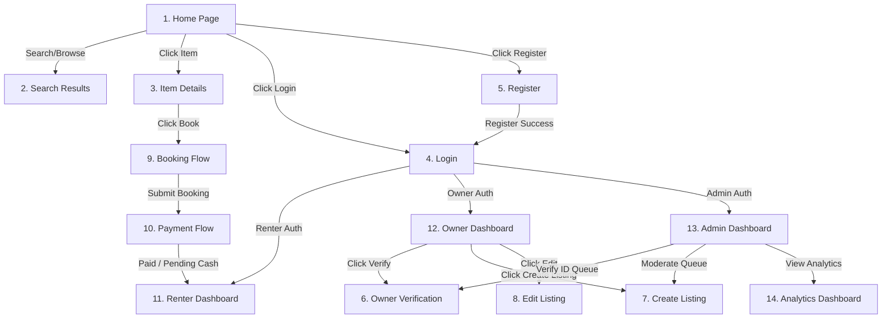

# Wireframes and Page Flow Specification — Item Rental System

This document outlines the complete wireframe layout specifications and user interface behavior for the Item Rental System. It details responsive structures, dynamic interactions, validation feedbacks, bidirectional RTL/LTR adaptations, and page navigation flows.

This spec conforms to the requirements in [software_requirements_specification.md](file:///E:/UserFiles/Desktop/hackthon/software_requirements_specification.md) and maps directly to the user stories in [user_stories.md](file:///E:/UserFiles/Desktop/hackthon/user_stories.md).

---

## 1. System-Wide Layout and Bidirectional Rules

All pages share a consistent layout container supporting bidirectional rendering (LTR for English, RTL for Arabic):

*   **LTR (English)**: Left-to-right reading flow. Main sidebar aligns on the left; search bars place icons on the right; navigation menu items flow left-to-right.
*   **RTL (Arabic)**: Right-to-left reading flow. Sidebar moves to the right; logo and navigation options mirror horizontally; search input text aligns right; icons mirror where logical (e.g., arrows point left instead of right for "back").
*   **Mobile Responsiveness**: Viewports stack vertically. Grids collapse to single columns. Desktop headers compress to standard burger menus.

---

## 2. Page Flow Diagrams

---

## 3. Detailed Wireframe Specifications

---

### Page 1: Home Page
*   **Purpose**: Introduce users to the platform and provide access to search and highlighted categories.
*   **Components**:
    *   **Header**: Brand Logo, Search Bar, Language Switcher (EN/AR), Login/Register buttons.
    *   **Hero Section**: Headline, search input field with calendar date-picker.
    *   **Category Grid**: Icon-based grid linking to filtered searches (e.g. Tools, Camping).
    *   **Featured Items Section**: Multi-column list of top rated listings.
*   **Desktop Layout (LTR)**:
    *   Header: Logo on left, navigation on right.
    *   Hero: Left-aligned text, right-aligned banner graphic.
    *   Grids: 4 columns for categories and items.
*   **LTR Layout**: Left-aligned grid listings. Text runs left-to-right.
*   **RTL Layout**: Right-aligned grids. Logo on right, navigation toggles align left. Hero text right-aligned.
*   **Mobile Layout**: Grids collapse to 1 column. Header converts to a sticky top navbar with a collapsible burger menu drawer.
*   **Interactions**: Clicking a category routes to `/api/search?categoryId=X`. Typing in search bar and clicking search routes to Search Results page.
*   **Validation Messages**: "Please enter a valid keyword" (if searching empty strings).

---

### Page 2: Search & Filter Page
*   **Purpose**: Allow users to query listings and refine results using filters.
*   **Components**:
    *   **Sidebar Filter Panel**: Keyword input, category dropdown, price slider, condition checkboxes (New, Good, Acceptable), and booking date selectors.
    *   **Results Grid**: Shows matching item cards containing: title, photo, condition, daily price, deposit, and owner rating.
    *   **Sorting Bar**: Dropdown to sort by Price (Low to High, High to Low) or Ratings.
*   **Desktop Layout (LTR)**:
    *   Sidebar: Filters column on left (25% width).
    *   Main Grid: Listing cards on right (75% width, 3 columns).
*   **LTR Layout**: Filter labels on left. Card details left-aligned.
*   **RTL Layout**: Filter panel moves to right side. Grid cards on left. Text and slider track mirror horizontally.
*   **Mobile Layout**: Filters collapse into a floating "Filter" button that opens as a full-screen bottom-sheet modal. Results display in a single-column card feed.
*   **Interactions**: Modifying filters executes real-time AJAX queries without page reloads.
*   **Validation Messages**: "Start date must be in the future", "Daily price must be positive".

---

### Page 3: Item Details Page
*   **Purpose**: Display all information about a listing and provide access to booking.
*   **Components**:
    *   **Photo Gallery**: Main image carousel with thumbnails.
    *   **Listing Details Panel**: Title, price, category, condition, deposit, and description.
    *   **Owner Card**: Owner name, verified status badge, average review rating.
    *   **Booking Widget**: Calendar date range selection, price calculator breakdown, and "Book Now" submit button.
*   **Desktop Layout (LTR)**:
    *   Gallery and Details: Left column (60% width).
    *   Booking Widget & Owner Card: Sticky right sidebar (40% width).
*   **LTR Layout**: Details run left-aligned. Widget on right.
*   **RTL Layout**: Details run right-aligned. Widget moves to sticky left sidebar.
*   **Mobile Layout**: Gallery on top, details in middle, booking widget pins as a sticky footer action button at the bottom of the screen.
*   **Interactions**: Clicking "Book Now" redirects to the Booking Flow. Clicking photo thumbnails updates the main viewer.
*   **Validation Messages**: "Selected dates are blocked" / "التواريخ المحددة غير متوفرة".

---

### Page 4: Login Page
*   **Purpose**: Authenticate registered Renters, Owners, and Admins.
*   **Components**:
    *   **Login Form Card**: Email field, Password field, "Remember Me" checkbox, "Forgot Password" link, "Login" button, and Register redirect link.
*   **Layout (Centered Card)**: Form card occupies 400px centered horizontally and vertically on a clean background.
*   **LTR Layout**: Text aligns left inside the card.
*   **RTL Layout**: Text aligns right. Forms mirror layout direction.
*   **Mobile Layout**: Form card expands to occupy 100% viewport width with padding.
*   **Interactions**: Submitting credentials triggers JWT request.
*   **Validation Messages**:
    *   Email: "Enter a valid email address".
    *   Credentials Error: "Invalid email or password" (EHR-001).

---

### Page 5: Register Page
*   **Purpose**: Allow Guests to register accounts.
*   **Components**:
    *   **Registration Card**: Name, Email, Phone, Password, Role choice (Renter/Owner), Language preference, and Submit button.
*   **Layout (Centered Card)**: 480px width centered card layout.
*   **LTR Layout**: Form inputs left-aligned.
*   **RTL Layout**: Form inputs right-aligned.
*   **Mobile Layout**: Card expands to full viewport width.
*   **Interactions**: Submitting triggers validation and API request.
*   **Validation Messages**:
    *   "Password must be at least 8 characters long and contain uppercase, lowercase, and numeric characters" (VR-002).
    *   "Email is already registered" (EHR-002).

---

### Page 6: Owner Verification Page
*   **Purpose**: Enable Owners to submit National IDs and check verification status.
*   **Components**:
    *   **File Dropzone**: Drag-and-drop file upload container.
    *   **Request Status Banner**: Display banner indicating current status: `Pending`, `Approved`, or `Rejected`.
    *   **Admin Reason Block**: Display Admin rejection reasons if status is `Rejected`.
*   **Layout**: Single column layout nested inside the Owner Dashboard wrapper.
*   **LTR / RTL Layout**: Standard text alignment mirroring. File upload progress bar runs left-to-right in LTR and right-to-left in RTL.
*   **Mobile Layout**: File dropzone expands to cover full width; button fills the screen width.
*   **Interactions**: Dragging file or clicking dropzone opens local file system.
*   **Validation Messages**: "File size exceeds 10MB limit", "Invalid format. Only JPG, PNG, and PDF accepted".

---

### Page 7: Create Listing Page
*   **Purpose**: Allow verified Owners to create new item listings.
*   **Components**:
    *   **Form**: Title, Description, Category, Condition, Price, Deposit, Photo dropzone.
    *   **Actions**: "Save Draft", "Submit for Approval", "Cancel".
*   **Layout**: Structured step-by-step layout (Step 1: Item details, Step 2: Pricing & Photos).
*   **LTR / RTL Layout**: Alignment mirrored based on active language.
*   **Mobile Layout**: Linear vertical layout. Forms are full-screen width.
*   **Interactions**: Uploading files adds thumbnail previews with delete buttons.
*   **Validation Messages**:
    *   "Title must be at least 5 characters long".
    *   "Description must be at least 20 characters long".

---

### Page 8: Edit Listing Page
*   **Purpose**: Allow Owners to modify listing details.
*   **Components**:
    *   **Form**: Populated with existing listing attributes.
    *   **Moderation Alert**: Warning stating that major edits will return listing to the moderation queue.
*   **Layout**: Similar to Page 7, showing current photo previews with "delete" badges on each.
*   **LTR / RTL Layout**: Alignment mirrored.
*   **Mobile Layout**: Linear vertical form.
*   **Validation Messages**: "Approved bookings exist. Daily price and deposit changes will only apply to future bookings".

---

### Page 9: Booking Flow Page
*   **Purpose**: Step-by-step checkout wizard for date validation and price breakdown.
*   **Components**:
    *   **Step 1: Dates Confirmation**: Calendar view locking search ranges.
    *   **Step 2: Invoice Breakdown**: Row-by-row cost display:
        *   Daily Rental Fee: Daily Price x Days.
        *   Security Deposit: Snapshot value.
        *   Platform Fee: Configured value.
        *   Total Billing.
    *   **Action**: "Proceed to Payment".
*   **Layout**: Split panel. Step forms on left, invoice breakdown card sticky on right.
*   **LTR / RTL Layout**: Invoice layout mirrored.
*   **Mobile Layout**: Invoice card pins to bottom as a summary sheet; forms stack vertically.
*   **Validation Messages**: "Dates overlap with an existing booking".

---

### Page 10: Payment Flow Page
*   **Purpose**: Handle online credit card capture or cash selection.
*   **Components**:
    *   **Payment Selectors**: "Online Credit Card Payment" or "Cash On Pickup" radio selectors.
    *   **Stripe Card Component**: Card Number, Expiry, CVV fields (rendered only if Online chosen).
    *   **Cash Warning Panel**: Shows instructions for manual pickup collection.
    *   **Action**: "Pay and Reserve" button.
*   **Layout**: Centered checkout layout.
*   **LTR / RTL Layout**: Inputs mirrored. Card brand logos align right in LTR, left in RTL.
*   **Mobile Layout**: Checkout card stretches to fit mobile viewports.
*   **Validation Messages**: "Card authorization failed. Please try another card", "Expiry date is invalid".

---

### Page 11: Renter Dashboard
*   **Purpose**: Renter portal for tracking bookings, rentals, and reviews.
*   **Components**:
    *   **Dashboard Navigation Tabs**: Active Rentals, Booking Requests, History.
    *   **Booking Cards**: Summary cards showing item image, dates, status (`Pending`, `Approved`, `Active`, `Returned`), and dynamic action buttons: "Cancel" (if Pending), "Pay Now" (if unpaid Online), "Write Review" (if Returned).
*   **Layout**: Sidebar navigation (20% width) + content grid (80% width).
*   **LTR Layout**: Sidebar on left, contents on right.
*   **RTL Layout**: Sidebar moves to right, contents align left.
*   **Mobile Layout**: Sidebar turns into a top horizontal scrolling tab selector. Cards span 100% width.
*   **Interactions**: Clicking "Cancel" opens a confirmation modal. Clicking "Write Review" opens review editor.

---

### Page 12: Owner Dashboard
*   **Purpose**: Owner portal for listings, bookings approvals, handovers, and damage reports.
*   **Components**:
    *   **Listings List**: Shows current items, status indicators (`Active`, `Pending Approval`), and edit buttons.
    *   **Requests List**: Shows Renter names, dates, actions: "Approve", "Reject".
    *   **Active Handover Panel**: Lists items currently checked out with "Confirm Return" and "Report Damage" buttons.
*   **Layout**: Workspace grid. Left side: Requests and approvals; Right side: Active listings control.
*   **LTR / RTL Layout**: Mirrored layout.
*   **Mobile Layout**: Single feed sorted by priority (1st: pending booking requests, 2nd: handovers, 3rd: listings).

---

### Page 13: Admin Dashboard
*   **Purpose**: Admin interface for verifications, listing moderation, and audit lookups.
*   **Components**:
    *   **Verification Queue Table**: List of pending IDs with click-to-zoom images and approve/reject actions.
    *   **Listing Moderation Queue**: Listing details preview card with status resolve toggles.
    *   **Settings Form**: Table containing categories, platform pricing policies, and deposit terms.
*   **Layout**: Horizontal multi-tab view (Tab 1: Users, Tab 2: Listings, Tab 3: Policy Settings, Tab 4: Audits).
*   **LTR / RTL Layout**: Table headings and cell alignments mirrored.
*   **Mobile Layout**: Not optimized for mobile. Renders scrollable tables to prevent layout breaking.

---

### Page 14: Analytics Dashboard
*   **Purpose**: Provide Admins with a visual report on platform metrics.
*   **Components**:
    *   **Value Cards**: KPI blocks showing: Active Rentals, Total revenue, Verification backlog.
    *   **Charts**: Line charts for monthly revenue, bar charts for category popularity.
    *   **Data Table**: List of top rented items.
*   **Layout**: 3-column KPI card row on top, 2-column chart row in middle, full-width data grid at the bottom.
*   **LTR / RTL Layout**: Charts and card rows mirror alignment.
*   **Mobile Layout**: Grid collapses. Charts stack vertically.
*   **Interactions**: Hovering over chart points displays tooltips with values. Filter dropdowns dynamically reload metrics.
